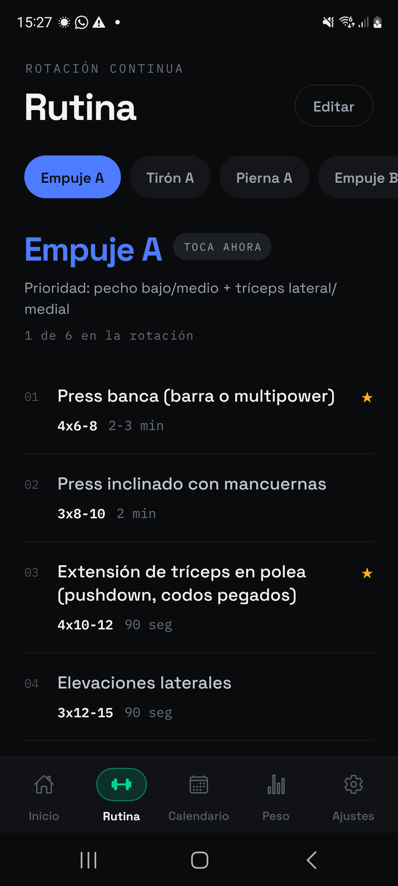
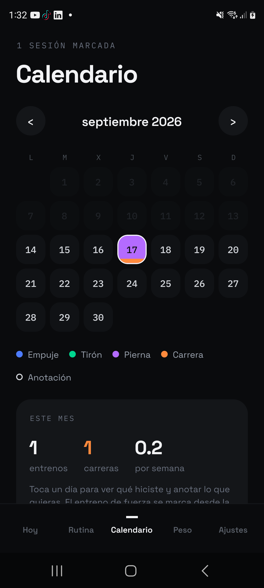
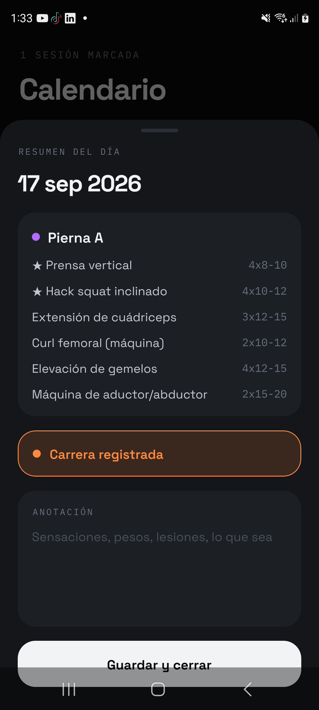

<div align="center">


# AMASA

**Seguimiento de entrenamiento de fuerza para Android e iOS.**
Rutina editable, calendario de actividad y control de peso corporal.

<br>


</div>

<br>

<div align="center">


<table>
<tr>
<td align="center" width="33%"></td>
<td align="center" width="33%"></td>
<td align="center" width="33%"></td>
</tr>
<tr>
<td align="center"><b>Rutina</b><br><sub>Sesiones y ejercicios editables</sub></td>
<td align="center"><b>Calendario</b><br><sub>Actividad por día y color</sub></td>
<td align="center"><b>Detalle</b><br><sub>Qué se hizo y anotaciones</sub></td>
</tr>
</table>

</div>

<br>

<div align="center">


</div>

<table>
<tr>
<td width="50%" valign="top">

###  &nbsp;Rutina editable

Sesiones y ejercicios totalmente configurables: nombre, grupo muscular, series,
repeticiones, descanso y prioridad. Se pueden crear, borrar y reordenar, y la
rotación avanza sola al marcar un entrenamiento.

</td>
<td width="50%" valign="top">

###  &nbsp;Calendario de actividad

Cada día se colorea según el grupo muscular trabajado, con una franja naranja
para las carreras y un indicador para los días con anotaciones. Los días pasados
se atenúan para situar la fecha actual de un vistazo.

</td>
</tr>
<tr>
<td width="50%" valign="top">

###  &nbsp;Resumen anual

Los doce meses en miniatura con un punto por día, navegable entre años, con
totales de entrenamientos, carreras y notas, y el reparto por grupo muscular.

</td>
<td width="50%" valign="top">

###  &nbsp;Peso corporal

Registro por fecha con nota opcional, curva de evolución dibujada en SVG y
diferencia acumulada respecto al peso inicial.

</td>
</tr>
<tr>
<td width="50%" valign="top">

###  &nbsp;Recordatorios locales

Aviso diario de entrenamiento que se omite en los días ya entrenados, y
recordatorio semanal de pesaje. Sin servidor: todo se programa en el dispositivo.

</td>
<td width="50%" valign="top">

###  &nbsp;Sin conexión y sin cuentas

Todos los datos viven en el dispositivo mediante `AsyncStorage`. No hay registro,
ni servidor, ni telemetría.

</td>
</tr>
</table>

<br>

<div align="center">


</div>

| Capa | Tecnología |
| :--- | :--- |
| Framework | React Native 0.86 · Expo SDK 57 |
| Lenguaje | TypeScript (modo estricto) |
| Navegación | React Navigation · Material Top Tabs con gestos |
| Persistencia | AsyncStorage |
| Gráficos | react-native-svg |
| Notificaciones | expo-notifications |
| Tipografías | Space Grotesk · IBM Plex Mono |

<br>

<div align="center">


</div>

```
src/
├── components/     Primitivas de UI, editores, selectores y gráficos
├── data/           Rutina de fábrica y tipos de sesión/ejercicio
├── lib/            Almacenamiento, fechas y notificaciones
├── navigation/     Navegador de pestañas y barra inferior
├── screens/        Inicio · Rutina · Calendario · Peso · Ajustes
├── state/          Contexto global y tipos del estado
└── theme.ts        Tokens de color, tipografía y espaciado
```

<br>

<div align="center">


</div>

```bash
git clone https://github.com/1van106/AMASA.git
cd AMASA
npm install
npx expo start
```

**Compilar el APK de Android**

Las carpetas nativas no se versionan: se generan a partir de `app.json`.

```bash
npx expo prebuild --platform android
cd android && ./gradlew assembleRelease
```

> [!TIP]
> El APK queda en `android/app/build/outputs/apk/release/`.

> [!NOTE]
> Los recordatorios locales requieren una compilación propia. Expo Go retiró el
> soporte de notificaciones en Android a partir del SDK 53.

> [!WARNING]
> `expo prebuild` **borra y regenera la carpeta `android/` entera**, incluido
> `local.properties`. Haz copia antes si tienes cambios nativos a mano.

<br>

<div align="center">


</div>

Tema oscuro sobre `#0A0B0D`, con un color por grupo muscular que se mantiene
coherente en toda la app: calendario, resumen anual, barra de navegación y
etiquetas de sesión.

<div align="center">

| Empuje | Tirón | Pierna | Carrera | Prioridad |
| :---: | :---: | :---: | :---: | :---: |
|  |  |  |  |  |

</div>

<br>

<div align="center">

Publicado bajo licencia MIT.

</div>
